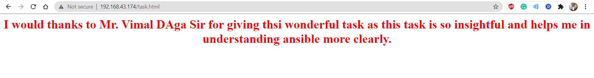

## Ansible Playbook to configure docker, enable it’s services and start the webserver

If you want to accomplish the following tasks using ansible playbook, you have landed on the correct source!

🔹 Configure Docker

🔹 Start and enable Docker services

🔹 Pull the httpd server image from the Docker Hub

🔹 Run the docker container and expose it to the public

🔹 Copy the html code in /var/www/html directory and start the web server

check the document file for step by step Configuration of Docker and its services via ansible.

Final output is here:-

